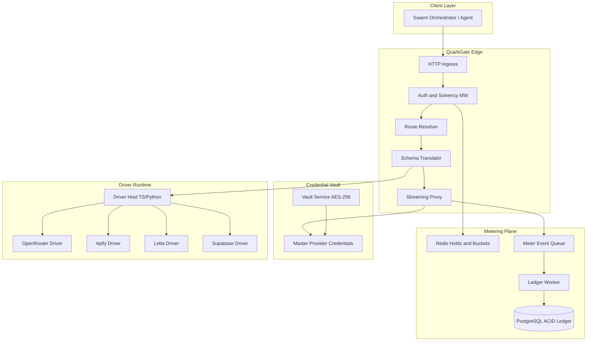
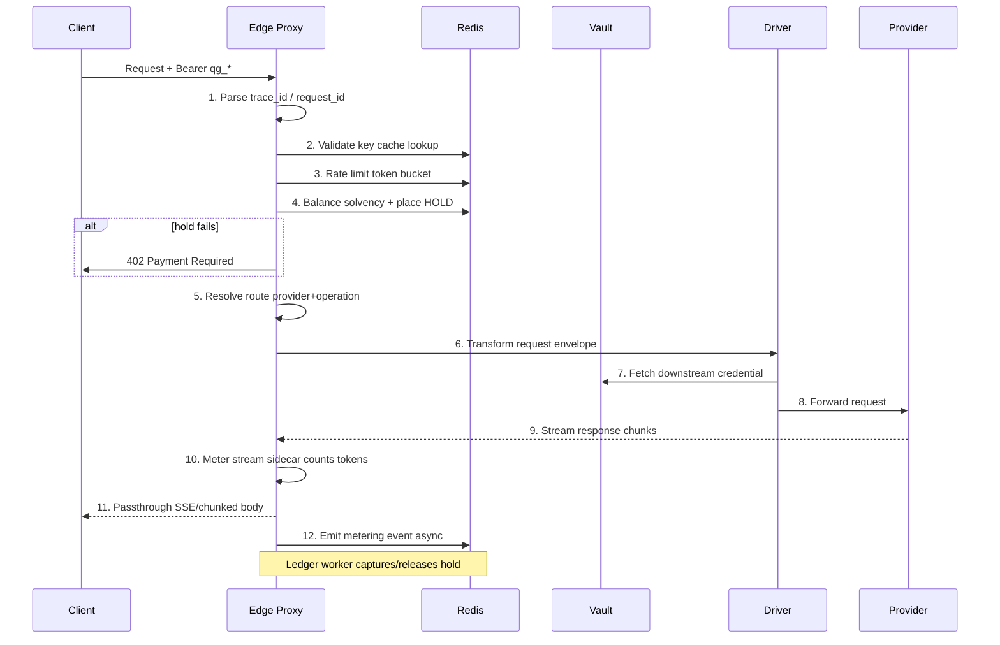
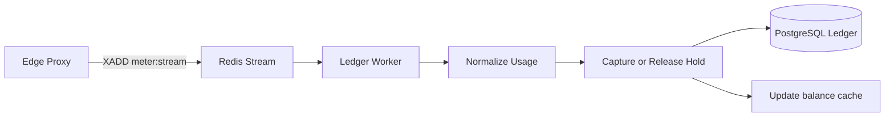
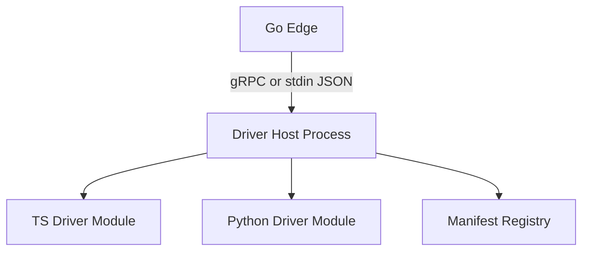
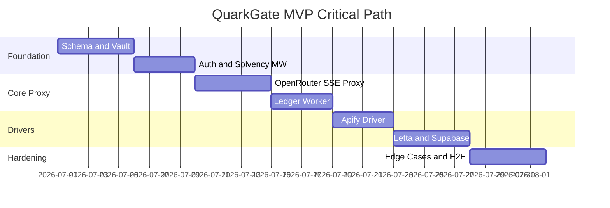

# QuarkGate Technical Implementation Plan

## Executive Summary

QuarkGate is a **unified reverse proxy + auth wrapper + micro-billing gateway**. End-users hold **one QuarkGate API key** and **one credit balance**; QuarkGate injects downstream credentials, translates protocols, meters usage, and deducts credits asynchronously.

**Current repo state:** Greenfield — only [`.cursor/`](.cursor/) workspace scaffolding exists. No application code yet.

**Recommended architecture:** **Modular monolith** for MVP (single deployable with clear internal boundaries), evolving to **edge proxy + metering workers + driver runtime** as scale demands.



---

## Phase 1: Stack Selection & Unified Schema Design

### 1.1 Stack Recommendation

| Layer | Choice | Rationale |
|-------|--------|-----------|
| **Proxy core** | **Go 1.22+** (`net/http` + `httputil.ReverseProxy` or `github.com/valyala/fasthttp` for hot paths) | Goroutine-per-connection, excellent SSE/chunked streaming, low GC pressure, single binary deploy |
| **Driver SDK / plugins** | **TypeScript (Node 20+)** + optional **Python 3.12** subprocess drivers | Contributor-friendly; matches agent ecosystem (MCP, OpenAI schemas); isolate untrusted drivers via subprocess IPC |
| **Primary ledger** | **PostgreSQL 16+** (hosted Supabase acceptable) | ACID transactions, `NUMERIC` precision, RLS for multi-tenant, `pgvector` co-location for memory drivers |
| **Fast metering** | **Redis 7+** (Streams + Lua scripts) | Atomic holds, token buckets, idempotency keys, metering event buffer |
| **Secrets** | **AES-256-GCM** envelope encryption; master key from env/KMS | Per-credential DEK wrapped by KEK; never store plaintext in PG |
| **Observability** | OpenTelemetry + Prometheus + structured logs (`slog`) | Trace request → driver → downstream; correlate metering events |
| **MVP deploy** | Docker Compose (local PoC) → Fly.io / AWS ECS / k8s | Start simple; edge scales independently later |

**Why not Rust-only or Node-only?**
- Rust: best latency but slows OSS contributor velocity for drivers.
- Node-only: SSE + billing at scale risks event-loop contention; Go edge + Node driver host is the pragmatic split.

**Why not Kafka for MVP?**
- Redis Streams suffice until >10k metering events/sec sustained; add Kafka/Redpanda in Phase 5 hardening.

### 1.2 Repository Layout (proposed)

```
quarkgate/
├── cmd/gateway/          # Go edge proxy binary
├── cmd/ledger-worker/    # Async metering consumer
├── internal/
│   ├── auth/             # Key validation, solvency
│   ├── proxy/            # Reverse proxy, SSE passthrough
│   ├── metering/         # Holds, normalization, events
│   ├── vault/            # Encrypt/decrypt credentials
│   └── registry/         # Provider + driver routing
├── drivers/
│   ├── sdk/              # TS/Python driver interfaces
│   ├── openrouter/
│   ├── apify/
│   ├── letta/
│   └── supabase/
├── schemas/
│   ├── quarkgate-request.v1.json
│   ├── metering-event.v1.json
│   └── driver-manifest.v1.json
├── migrations/           # SQL migrations (golang-migrate or Supabase)
├── docker-compose.yml
└── docs/architecture/
```

### 1.3 Unified Request Schema (QuarkGate Envelope)

All clients send a **QuarkGate envelope** (or OpenAI-compatible shim for LLM routes):

```json
{
  "quarkgate_version": "1",
  "provider": "openrouter",
  "operation": "chat.completions.create",
  "payload": { /* provider-native or canonical payload */ },
  "metering_hints": {
    "estimated_max_credits": 5000,
    "priority": "normal"
  },
  "trace_id": "optional-client-trace"
}
```

**Canonical operations** map via driver manifests: `provider + operation → downstream URL, method, transform rules`.

**OpenAI-compat shortcut:** `POST /v1/chat/completions` with standard OpenAI body routes to OpenRouter driver without envelope (MVP convenience).

### 1.4 Relational Database Schema

All monetary values stored as **`BIGINT micro_credits`** (1 QuarkGate Credit = 1,000,000 micro_credits) to avoid float drift.

#### Core tables

**`users`**
- `id` UUID PK
- `email` TEXT UNIQUE
- `status` ENUM (`active`, `suspended`, `closed`)
- `credit_balance_micro` BIGINT NOT NULL DEFAULT 0 (cached; reconciled from ledger)
- `created_at`, `updated_at`

**`quarkgate_keys`**
- `id` UUID PK
- `user_id` UUID FK → users
- `key_prefix` TEXT (first 8 chars for lookup, e.g. `qg_live_`)
- `key_hash` TEXT UNIQUE (bcrypt or HMAC-SHA256 of full key)
- `name` TEXT (user label)
- `scopes` JSONB (allowed providers/operations)
- `rate_limit_rpm` INT
- `status` ENUM (`active`, `revoked`)
- `last_used_at`, `created_at`, `revoked_at`

**`provider_configs`**
- `id` UUID PK
- `provider_slug` TEXT UNIQUE (e.g. `openrouter`, `apify`, `letta`)
- `display_name` TEXT
- `category` ENUM (`llm`, `scraper`, `memory`, `execution`, `ui`)
- `base_url` TEXT
- `auth_injection` JSONB (header name, prefix, vault credential ref)
- `pricing_model` JSONB (see normalization in Phase 3)
- `health_check_path` TEXT
- `enabled` BOOLEAN
- `driver_module` TEXT (path to driver package)
- `created_at`, `updated_at`

**`credential_vault_entries`**
- `id` UUID PK
- `provider_config_id` UUID FK
- `label` TEXT (e.g. `master_openrouter`)
- `encrypted_blob` BYTEA (AES-GCM: nonce + ciphertext)
- `key_version` INT (for KEK rotation)
- `created_at`, `rotated_at`

**`credit_ledger_transactions`** (immutable append-only)
- `id` UUID PK
- `user_id` UUID FK
- `type` ENUM (`deposit`, `hold`, `capture`, `release`, `adjustment`, `refund`)
- `amount_micro` BIGINT (signed: deposits positive, captures negative)
- `balance_after_micro` BIGINT (snapshot after txn)
- `reference_type` TEXT (`usage_log`, `payment`, `admin`)
- `reference_id` UUID
- `idempotency_key` TEXT UNIQUE
- `metadata` JSONB
- `created_at` TIMESTAMPTZ

**`usage_logs`**
- `id` UUID PK
- `user_id` UUID FK
- `quarkgate_key_id` UUID FK
- `provider_slug` TEXT
- `operation` TEXT
- `request_id` UUID UNIQUE (correlates hold → capture)
- `status` ENUM (`pending`, `completed`, `failed`, `partial`)
- `raw_usage` JSONB (provider-native metrics)
- `normalized_usage` JSONB (canonical units)
- `credits_reserved_micro` BIGINT
- `credits_captured_micro` BIGINT
- `latency_ms` INT
- `trace_id` TEXT
- `started_at`, `completed_at`

**`metering_sessions`** (active in-flight requests)
- `request_id` UUID PK
- `user_id` UUID
- `hold_micro` BIGINT
- `expires_at` TIMESTAMPTZ (TTL for abandoned holds)
- `stream_state` JSONB (token counts mid-stream)

#### Indexes and constraints
- `credit_ledger_transactions(user_id, created_at DESC)`
- `usage_logs(user_id, started_at DESC)`
- `quarkgate_keys(key_hash)` unique
- CHECK: `credit_balance_micro >= 0` on users (enforced at capture, not hold edge cases)
- Ledger: **no UPDATE/DELETE** — corrections via `adjustment` rows only

### 1.4 Redis Key Design

| Key pattern | Purpose |
|-------------|---------|
| `balance:{user_id}` | Cached balance (synced from PG on write) |
| `hold:{request_id}` | Active credit hold amount |
| `key:{key_hash}` | Cached key metadata + user_id |
| `bucket:{user_id}:rpm` | Token bucket rate limit |
| `meter:stream` | Redis Stream for metering events |
| `idem:{idempotency_key}` | 24h idempotency cache |

### Phase 1 Sub-tasks

1. **P1.1** — Create monorepo skeleton (`go.mod`, `package.json` for drivers, `docker-compose.yml` with PG + Redis)
2. **P1.2** — Author SQL migrations for all tables above + seed `provider_configs` for MVP providers
3. **P1.3** — Define JSON Schemas in `schemas/` and validate in CI
4. **P1.4** — Implement `internal/vault` with AES-256-GCM encrypt/decrypt + KEK from env
5. **P1.5** — Build admin CLI: `quarkgate admin create-user`, `create-key`, `deposit-credits`, `seed-provider`
6. **P1.6** — Document credit unit: 1 Credit = $0.01 USD equivalent at launch (configurable `CREDIT_USD_MICRO`)

---

## Phase 2: Reverse Proxy & Streaming Auth Architecture

### 2.1 Middleware Pipeline (exact order)



| Step | Middleware | Action | Failure response |
|------|------------|--------|------------------|
| 1 | `RequestID` | Generate `request_id`, attach to context | — |
| 2 | `Auth` | Parse `Authorization: Bearer <key>`, hash, lookup | `401 Unauthorized` |
| 3 | `Scope` | Check key scopes vs route | `403 Forbidden` |
| 4 | `RateLimit` | Redis token bucket per key/user | `429 Too Many Requests` |
| 5 | `Solvency` | Estimate max cost from route + hints; `HOLD` in Redis + insert `metering_sessions` | `402 Insufficient Credits` |
| 6 | `Route` | Match path/body to `provider_configs` + driver | `404 Unknown route` |
| 7 | `Transform` | Driver `PrepareRequest()` | `400 Bad Request` |
| 8 | `Proxy` | Inject auth, forward HTTP | downstream error passthrough |
| 9 | `StreamMeter` | Sidecar on response body | partial metering on failure |
| 10 | `MeterEmit` | Push event to Redis Stream (non-blocking) | log + reconcile later |

**Critical rule:** Steps 1–7 happen **before** downstream connection. Step 5 uses **pessimistic hold** (reserve max estimated cost); step 10 **captures actual** and **releases remainder**.

### 2.2 Bearer Token Format

- Prefix: `qg_live_` / `qg_test_`
- 32+ random bytes, base62 encoded
- Store only `key_hash`; display full key once at creation

### 2.3 Streaming / SSE Architecture

**Goals:** Zero proxy buffering, accurate token telemetry, no timeout on long generations.

**Implementation (Go):**

1. Use `http.ResponseController` to disable write timeouts for streaming routes.
2. Wrap downstream `resp.Body` in a `meteringReader` that:
   - Parses OpenAI-style SSE lines (`data: {...}`) for `usage` field on final chunk
   - Counts output tokens via driver-provided `StreamTokenizer` (fallback: byte/char estimate)
   - Flushes each chunk immediately to client `io.Writer` via `http.Flusher`
3. **Dual-path metering:**
   - **Fast path:** Provider sends `usage` in final SSE event → trust it
   - **Fallback path:** Increment counters per chunk; reconcile in capture
4. **Heartbeat:** If downstream silent >30s, inject SSE comment `: keepalive\n\n` to client (configurable)
5. **Client disconnect:** Cancel downstream request via context; emit `partial` usage_log; release unused hold

**Anti-buffering checklist:**
- Set `X-Accel-Buffering: no`
- Do not use middleware that buffers full body
- `Transfer-Encoding: chunked` end-to-end
- Separate **connect timeout** (5s) from **stream timeout** (none or 30min per tier)

### 2.4 Idempotency

- Clients may send `Idempotency-Key` header
- Edge checks Redis `idem:{key}` → return cached response metadata for replay-safe operations
- Ledger worker uses same key for capture deduplication

### Phase 2 Sub-tasks

1. **P2.1** — Implement Go HTTP server skeleton with middleware chain
2. **P2.2** — `Auth` + `Scope` middleware with PG fallback on cache miss
3. **P2.3** — `Solvency` middleware: hold placement + `metering_sessions` row
4. **P2.4** — Generic `ReverseProxy` with credential injection hook
5. **P2.5** — `StreamMeter` reader with OpenAI SSE parser
6. **P2.6** — Health endpoints: `/healthz`, `/readyz` (PG + Redis checks)
7. **P2.7** — Integration test: mock downstream SSE server, verify byte-identical passthrough + token counts

---

## Phase 3: Telemetry, Metering, and Credit Trickle-Down Math

### 3.1 Async Metering Pipeline



**Non-blocking guarantee:** Edge only does Redis `XADD` + hold ops (<2ms). No PG writes on hot path.

**Ledger worker responsibilities:**
1. Consume `meter:stream` consumer group
2. Load `metering_sessions` + `usage_logs` by `request_id`
3. Call driver `NormalizeUsage(raw_usage) → micro_credits`
4. Transaction: `capture` actual + `release` (hold - actual) + update `usage_logs` + `users.credit_balance_micro`
5. On failure: retry with exponential backoff; poison queue after N attempts

**Reconciliation job (hourly):** Sum ledger vs cached balance; alert on drift.

### 3.2 Hold / Capture / Release Model (FinTech pattern)

| Event | Ledger type | Amount |
|-------|-------------|--------|
| Request start | `hold` | -max_estimate (reserved) |
| Request success | `capture` | -actual_usage |
| Request success | `release` | +(max_estimate - actual) |
| Request fail before downstream | `release` | +max_estimate (full) |
| Request fail mid-stream | `capture` | -partial_actual |
| Request fail mid-stream | `release` | +(max_estimate - partial) |

### 3.3 Unified Credit Normalization Model

**Canonical usage units** (stored in `normalized_usage`):

| Unit | Code | Description |
|------|------|-------------|
| Tokens | `TOK` | Input + output LLM tokens |
| Compute seconds | `COMPUTE_S` | Apify actor, sandbox runtime |
| DB reads | `DB_READ` | Supabase/PostgREST read ops |
| DB writes | `DB_WRITE` | Inserts/updates |
| Vector queries | `VEC_QUERY` | pgvector similarity searches |
| API calls | `API_CALL` | Flat per-request (Letta memory ops) |
| Storage bytes | `STORAGE_B` | Obsidian/cold storage (monthly amortization) |

**Normalization formula:**

```
micro_credits = Σ ( quantity[u] × rate[u] × provider_multiplier[p] )
```

Where `rate[u]` is stored in `provider_configs.pricing_model`:

```json
{
  "base_rates_micro_per_unit": {
    "TOK_INPUT": 300,
    "TOK_OUTPUT": 900,
    "COMPUTE_S": 50000,
    "DB_READ": 10,
    "DB_WRITE": 50,
    "VEC_QUERY": 200,
    "API_CALL": 1000
  },
  "model_overrides": {
    "anthropic/claude-3-opus": { "TOK_OUTPUT": 4500 }
  },
  "minimum_charge_micro": 100
}
```

**Example conversions (illustrative rates):**
- OpenRouter GPT-4o: 1000 input tokens → `1000 × 300 = 300,000` micro_credits
- Apify actor: 45 compute seconds → `45 × 50,000 = 2,250,000` micro_credits
- Supabase: 3 reads + 1 write → `3×10 + 1×50 = 80` micro_credits

**Provider-reported USD passthrough (OpenRouter):** When provider returns `usage.cost` in USD, prefer:

```
micro_credits = usd_micro × (1 + platform_margin) × credit_usd_exchange
```

This avoids manual rate tables for dynamic OpenRouter pricing. Store both `raw_usage.cost_usd` and normalized credits for audit.

### 3.4 Telemetry Schema (`metering-event.v1.json`)

```json
{
  "request_id": "uuid",
  "user_id": "uuid",
  "provider": "openrouter",
  "operation": "chat.completions.create",
  "status": "completed",
  "raw_usage": { "input_tokens": 120, "output_tokens": 450 },
  "partial": false,
  "duration_ms": 3200,
  "timestamp": "ISO8601"
}
```

### 3.5 Observability

- **Metrics:** `quarkgate_requests_total`, `quarkgate_credits_captured_micro`, `quarkgate_hold_failures`, `quarkgate_stream_duration_seconds`
- **Traces:** Span per middleware + downstream call
- **Audit:** Every `usage_logs` row links to ledger transaction IDs

### Phase 3 Sub-tasks

1. **P3.1** — Redis Stream producer in edge (`MeterEmit` middleware)
2. **P3.2** — Ledger worker with PG transactional capture/release
3. **P3.3** — Implement normalization engine reading `provider_configs.pricing_model`
4. **P3.4** — OpenRouter USD passthrough path in openrouter driver
5. **P3.5** — Hold TTL sweeper: release abandoned holds after 15min
6. **P3.6** — Reconciliation cron + drift alert
7. **P3.7** — Admin dashboard queries (balance, usage by provider, last 24h burn rate)

---

## Phase 4: Pluggable Driver Architecture

### 4.1 Driver Interface Contract

Each driver implements (Go invokes via subprocess or gRPC sidecar):

```typescript
// drivers/sdk/driver.ts
export interface QuarkGateDriver {
  manifest: DriverManifest;
  prepareRequest(ctx: DriverContext, envelope: QuarkGateEnvelope): DownstreamRequest;
  parseResponse(ctx: DriverContext, headers: Headers, body: Readable): MeteringContext;
  normalizeUsage(raw: Record<string, unknown>): NormalizedUsage;
  estimateMaxCost(envelope: QuarkGateEnvelope): number; // micro_credits
  healthCheck(): Promise<HealthStatus>;
}
```

**Driver manifest** (`driver.manifest.json` or `DRIVER.md` with YAML frontmatter):

```yaml
id: openrouter
version: 1.0.0
category: llm
operations:
  - id: chat.completions.create
    method: POST
    path: /api/v1/chat/completions
    streaming: true
    compat_paths: ["/v1/chat/completions"]
pricing:
  passthrough_usd: true
```

### 4.2 Driver Host Runtime



**MVP:** Go spawns `node drivers/<id>/index.js` per request (pool later) with JSON IPC:
- Input: envelope + vault credential handle (not raw secret — host fetches from Go)
- Output: downstream URL, headers, body, estimated cost

**Contributor path:**
1. Copy `drivers/_template/`
2. Fill `DRIVER.md` manifest
3. Implement `driver.ts`
4. PR adds row to `provider_configs` seed migration
5. CI runs driver contract tests against recorded fixtures

### 4.3 Provider Taxonomy → Driver Mapping

| Category | Providers | Driver notes |
|----------|-----------|--------------|
| **LLM direct** | OpenAI, Anthropic, Google | OpenAI-compat shim; per-vendor auth headers |
| **LLM aggregate** | OpenRouter | USD passthrough + model overrides |
| **Scraping** | Apify | Poll run status; meter `COMPUTE_S` from run stats |
| **Memory graph** | Letta | REST proxy; meter `API_CALL` + `TOK` for embedded LLM calls |
| **Memory semantic** | Mem0, LangMem | Batch embed/search metering |
| **Vector backend** | Supabase | Wrap PostgREST; count rows read/written |
| **Cold storage** | Obsidian | File read/write bytes; optional git sync |
| **Execution** | OpenClaw, Hermes, Claude Code, Codex, Cursor CLI | Session-based `COMPUTE_S`; sandbox isolation |
| **UI** | cmux | Multiplex session minutes |

### 4.4 Protocol Translation Engine

**Layers:**
1. **Ingress adapters** — OpenAI-compat, raw envelope, MCP JSON-RPC (Phase 2+)
2. **Canonical operation resolver** — `(path, method, body.model)` → `operation id`
3. **Driver transform** — canonical → downstream payload
4. **Response adapter** — downstream → canonical (optional OpenAI-shaped response)

**MCP support (post-MVP):** MCP tool calls map to `operation = tools.{tool_name}` with driver-provided tool registry in manifest.

### Phase 4 Sub-tasks

1. **P4.1** — Define `DriverManifest` JSON Schema + validator
2. **P4.2** — Build `drivers/sdk` TypeScript package with interface + test harness
3. **P4.3** — Driver host IPC protocol (JSON lines over stdin/stdout)
4. **P4.4** — Go `internal/registry` loads manifests from `drivers/*/DRIVER.md`
5. **P4.5** — Template driver `_template/` + contributor docs
6. **P4.6** — Contract test CI: golden files per driver
7. **P4.7** — Python driver SDK mirror (optional for ML-heavy drivers)

---

## Phase 5: MVP Milestones & Fault-Tolerance Hardening

### 5.1 MVP Scope

**In scope:** OpenRouter (LLM), Apify (scraping), Letta + Supabase (memory)
**Out of scope for MVP:** Direct OpenAI/Anthropic/Google, Mem0, LangMem, Obsidian, execution pools, cmux

### 5.2 Milestone Sequence

| Milestone | Deliverable | Verification |
|-----------|-------------|--------------|
| **M0: Foundation** | PG schema, Redis, docker-compose, vault encrypt/decrypt | `make test-infra` connects |
| **M1: Identity** | User + key creation CLI, auth middleware | Invalid key → 401 |
| **M2: Solvency** | Hold on request, 402 on zero balance | Balance 0 → 402 before downstream |
| **M3: OpenRouter** | Chat completion proxy, SSE streaming, token metering | `curl` streaming chat; usage_log populated |
| **M4: Ledger** | Async capture/release; balance decrements | Ledger sum matches balance |
| **M5: Apify** | Run actor + poll; meter compute seconds | Apify actor completes; credits deducted |
| **M6: Letta** | Proxy Letta agent API; meter API calls | Create agent + message via QuarkGate key |
| **M7: Supabase** | Vector query proxy; meter reads/writes | pgvector search via QuarkGate |
| **M8: E2E Agent** | Sample orchestrator script using one key across all four | Single script, one bearer token |
| **M9: Hardening** | Circuit breakers, mid-stream failure, reconciliation | Chaos tests pass |

### 5.3 Edge-Case Protocols

#### Downstream failure mid-stream

1. **Detection:** Downstream closes connection, non-2xx, or parser error mid-chunk
2. **Client response:** Truncate stream; send terminal SSE `data: {"error":...}` if OpenAI-compat route
3. **Metering:** `status=partial`; capture pro-rated usage (tokens counted so far + minimum_charge)
4. **Hold:** Release remainder immediately
5. **Usage log:** `raw_usage.partial=true`, `completed_at` set
6. **Retry guidance:** Return `Retry-After` header; do not auto-retry non-idempotent ops

#### Credit balance hits $0 mid-agent transaction

**Prevention (primary):**
- Hold = `estimateMaxCost()` per request before downstream call
- Multi-step agents: each tool call is a separate request with its own hold
- Optional: `metering_hints.estimated_max_credits` from orchestrator

**During streaming (secondary):**
- Stream meter tracks running cost vs hold
- If running cost > hold (under-estimate): **soft cap** — inject stream error event `insufficient_credits`, close downstream, capture full hold
- Log `adjustment` row for any provider overage (platform absorbs or flags user)

**After hold exhausted across sequential calls:**
- Next request → `402` with body:
```json
{
  "error": "insufficient_credits",
  "balance_micro": 0,
  "top_up_url": "https://quarkgate.dev/dashboard/credits"
}
```
- In-flight holds still complete; new holds rejected

#### Downstream timeout

- Connect timeout: 5s → release hold, `502`
- Stream idle timeout: 30min default → partial capture

#### Vault credential failure

- Do not expose vault errors to client
- `503` with generic message; alert ops; release hold

#### Redis / PG unavailable

- Redis down: fail closed (503) — do not bypass solvency
- PG down: auth from Redis cache only; metering queues in Redis until PG recovers

### 5.4 Fault-Tolerance Components

- **Circuit breaker** per provider (failure rate >50% in 1min → open 30s)
- **Bulkhead** — max concurrent downstream connections per provider
- **Dead letter queue** — failed metering events in `meter:dlq`
- **Graceful shutdown** — drain streams before exit

### Phase 5 Sub-tasks

1. **P5.1** — M0–M2 implementation sequence
2. **P5.2** — OpenRouter driver + M3
3. **P5.3** — Ledger worker + M4
4. **P5.4** — Apify driver (async poll pattern) + M5
5. **P5.5** — Letta driver + M6
6. **P5.6** — Supabase driver (PostgREST + rpc) + M7
7. **P5.7** — E2E orchestrator example in `examples/swarm-minimal/`
8. **P5.8** — Chaos tests: kill downstream mid-stream, Redis flush, zero balance
9. **P5.9** — Circuit breaker + DLQ + runbook docs

---

## Security & Compliance Notes

- **TLS everywhere**; mTLS for internal services at scale
- **Key rotation:** vault `key_version` + re-encrypt job
- **Audit log:** immutable ledger + usage_logs
- **PII:** do not log request bodies by default; sampling with redaction
- **Tenant isolation:** RLS on all PG tables by `user_id`
- **SOC2 path:** separate `qg_test_` keys with fake providers for CI

---

## Suggested Build Order (Critical Path)



---

## Key Architectural Decisions (ADRs to write)

1. **ADR-001:** Go edge + TS driver host split
2. **ADR-002:** Micro-credits integer ledger (no floats)
3. **ADR-003:** Hold/capture/release over post-hoc billing
4. **ADR-004:** Redis Streams before Kafka
5. **ADR-005:** Subprocess driver IPC before WASM sandbox

---

## Success Criteria for MVP

- One `qg_live_*` key accesses OpenRouter, Apify, Letta, Supabase through QuarkGate
- Streaming LLM responses pass through without buffering delay >50ms vs direct
- Credit balance accurate to within 0.01% after 1000 mixed requests (reconciliation job)
- Driver addition requires only new `drivers/<name>/` folder + seed row (no edge code changes)
- Mid-stream failure and zero-balance scenarios behave per protocols above
