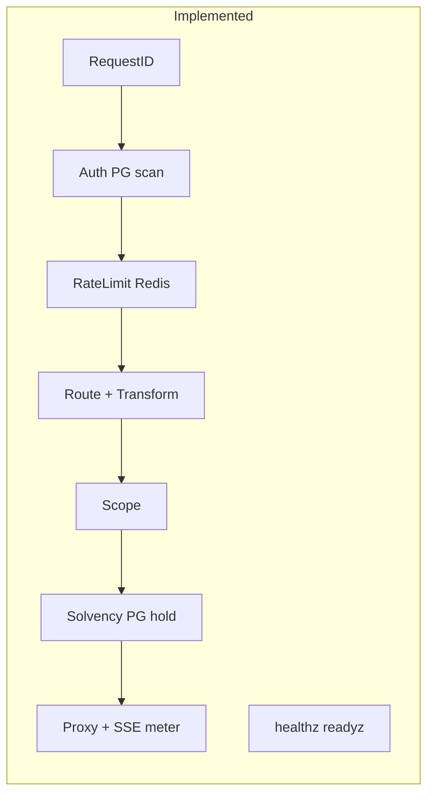
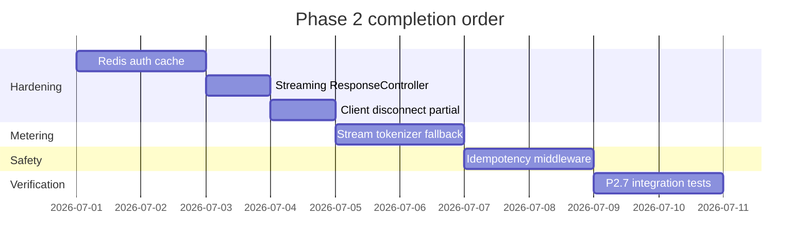

# Phase 2: Reverse Proxy & Streaming Auth — Implementation Plan

## Phase 1 status (prerequisite)

**Verdict: Phase 1 is implemented — proceed with Phase 2 completion, not Phase 1 rebuild.**

| Plan item | Status | Evidence |
|-----------|--------|----------|
| Repo skeleton + `go.mod` | Done | [`go.mod`](go.mod), [`cmd/`](cmd/) |
| SQL migrations (users, keys, ledger, usage_logs, provider_configs, vault) | Done | [`migrations/001_initial.sql`](migrations/001_initial.sql), [`002_seed_providers.sql`](migrations/002_seed_providers.sql) |
| Docker Compose (PG + Redis) | Done | [`docker-compose.yml`](docker-compose.yml) — ports **5433/6380** |
| JSON Schemas | Done | [`schemas/`](schemas/) |
| AES-256-GCM vault | Done | [`internal/vault/`](internal/vault/) |
| Admin CLI | Done | [`cmd/admin/main.go`](cmd/admin/main.go) — create-user, deposit-credits, create-key, store-credential, migrate |
| Credit unit docs | Done | [`docs/architecture/credits.md`](docs/architecture/credits.md) |

**Optional Phase 1 polish (non-blocking for Phase 2):** migration versioning table (currently raw `Exec` in [`internal/db/db.go`](internal/db/db.go)), explicit JSON Schema validation in CI, PostgreSQL RLS policies.

---

## Phase 2 current state

A **partial Phase 2 implementation already exists**. Treat this plan as **completion and hardening** against [docs/plans/phase_1_foundation.plan.md](phase_1_foundation.plan.md) §2.

### What is already built

| P2 sub-task | Status | Location |
|-------------|--------|----------|
| P2.1 HTTP server + middleware chain | Done | [`cmd/gateway/main.go`](cmd/gateway/main.go) |
| P2.2 Auth + Scope | Partial | [`internal/gateway/middleware.go`](internal/gateway/middleware.go) — no Redis key cache |
| P2.3 Solvency + metering_sessions | Done | [`SolvencyMiddleware`](internal/gateway/middleware.go), [`store.ApplyHold`](internal/store/store.go) |
| P2.4 Reverse proxy + credential injection | Done (custom handler) | [`internal/proxy/handler.go`](internal/proxy/handler.go), [`internal/gateway/route.go`](internal/gateway/route.go) |
| P2.5 StreamMeter + SSE parser | Partial | [`meteringReader`](internal/proxy/handler.go) — usage-only fast path |
| P2.6 `/healthz`, `/readyz` | Done | [`cmd/gateway/main.go`](cmd/gateway/main.go) |
| P2.7 Integration test | Partial | [`internal/proxy/handler_test.go`](internal/proxy/handler_test.go) — no byte-identical / token assertions |

### Middleware order (intentional deviation from plan diagram)

**Plan table order:** RequestID → Auth → Scope → RateLimit → Solvency → Route → Transform → Proxy

**Current order:** RequestID → Auth → RateLimit → Route+Transform → Scope → Solvency → Proxy

**Recommendation:** Keep **Route before Solvency** (hold amount requires `estimate_micro` from driver). Document this as ADR. Only reorder Scope to immediately after Route (already true).

---

## Phase 2 gaps to close

### Gap 1 — Redis auth key cache (Plan §2.1 step 2)

**Problem:** [`AuthMiddleware`](internal/gateway/middleware.go) scans PostgreSQL on every request via `findKeyByToken` (prefix scan + bcrypt compare).

**Work:**
1. On key creation ([`cmd/admin/main.go`](cmd/admin/main.go)), write Redis `key:{hmac}` → JSON metadata (`user_id`, `key_id`, scopes, rpm, status).
2. In Auth middleware: `keys.HMACHash(token, VAULT_KEK)` lookup → cache hit; on miss, PG fallback and repopulate cache.
3. Add `internal/auth/cache.go` (or extend [`internal/redis/client.go`](internal/redis/client.go)) with `GetKeyMeta` / `SetKeyMeta` already stubbed.
4. Unit test: cache hit avoids PG query (use mock or integration with Redis).

### Gap 2 — Idempotency middleware (Plan §2.4)

**Problem:** [`SetIdempotency` / `GetIdempotency`](internal/redis/client.go) exist but no middleware uses `Idempotency-Key` header.

**Work:**
1. Add `IdempotencyMiddleware` after RequestID in [`cmd/gateway/main.go`](cmd/gateway/main.go).
2. For replay-safe routes (POST envelope, chat completions): check `idem:{key}`; if present return cached response body + status from Redis (store on first success).
3. Scope: MVP stores response metadata + body for non-streaming only; streaming requests reject duplicate idempotency keys or return `409` with guidance.
4. Wire ledger idempotency: pass client idempotency key into metering event for worker dedup.

### Gap 3 — Streaming hardening (Plan §2.3)

**Problem:** Missing several spec items in [`internal/proxy/handler.go`](internal/proxy/handler.go).

| Requirement | Action |
|-------------|--------|
| Disable write timeout on streams | Use `http.NewResponseController(w).SetWriteDeadline(time.Time{})` before streaming copy |
| Configurable keepalive | Replace hardcoded `30*time.Second` with `h.idleSec` from config |
| Client disconnect cancels downstream | Tie `req` context to `r.Context()`; on cancel, emit `partial` metering event |
| `X-Accel-Buffering: no` | Already set — keep |
| 30min stream tier timeout | Add `STREAM_MAX_SEC` config; optional deadline on stream client context |

### Gap 4 — Dual-path metering (Plan §2.3)

**Problem:** Only fast path (final SSE `usage` object) is implemented.

**Work:**
1. Extend [`drivers/sdk/driver.js`](drivers/sdk/driver.js) with optional `estimateStreamUsage(chunks)` or `streamTokenizer` hook.
2. Implement OpenRouter fallback in [`drivers/openrouter/driver.js`](drivers/openrouter/driver.js): count `data:` chunks / approximate output tokens when `usage` missing.
3. In `meteringReader`, accumulate fallback counters; merge into `raw_usage` before `emitMeter`.
4. Pass merged usage in metering event for Phase 3 worker normalization.

### Gap 5 — Solvency / hot-path alignment

**Problem:** Solvency writes synchronously to PostgreSQL (`ApplyHold` ledger txn) on every request. Plan emphasizes Redis hold for speed; PG ledger hold can lag (Phase 3 worker).

**Work (Phase 2 scope — choose one path):**

- **Option A (minimal):** Keep PG hold but add Redis `hold:{request_id}` as primary fast check (already set); document latency budget.
- **Option B (plan-aligned):** Solvency only decrements Redis balance + sets Redis hold; emit `hold` event to `meter:stream`; ledger worker records PG `hold` txn asynchronously. Requires small contract change with Phase 3 worker.

**Recommendation:** Option A for this phase unless you want to refactor Phase 3 simultaneously; note Option B as follow-up.

### Gap 6 — P2.7 integration test

**Work:** Add [`internal/proxy/integration_test.go`](internal/proxy/integration_test.go) (or extend handler_test):
1. Mock SSE server returns known chunks + final `usage`.
2. Assert client response body **byte-identical** to downstream stream.
3. Assert emitted metering event / parsed `raw_usage` contains `input_tokens: 10, output_tokens: 20`.
4. Optional: full stack test with Redis + testcontainers for auth → solvency → proxy → meter emit.

### Gap 7 — Auth bypass for public routes

Confirm [`/healthz`](cmd/gateway/main.go) and [`/readyz`](cmd/gateway/main.go) remain outside auth chain (already correct). Add test.

---

## Implementation sequence

### Granular sub-tasks

1. **P2-A** — Redis key cache: populate on `create-key`, read in Auth, invalidate on revoke (add `admin revoke-key` if missing).
2. **P2-B** — `ResponseController` + `STREAM_IDLE_SEC` / `STREAM_MAX_SEC` in [`internal/config/config.go`](internal/config/config.go).
3. **P2-C** — Client disconnect: context-linked downstream cancel + `partial` status in metering event.
4. **P2-D** — Driver `streamTokenizer` + OpenRouter fallback counters in `meteringReader`.
5. **P2-E** — `IdempotencyMiddleware` for non-streaming POST routes.
6. **P2-F** — Integration test: byte-identical SSE passthrough + usage extraction.
7. **P2-G** — Document canonical middleware order + deviation rationale in [`docs/architecture/proxy-pipeline.md`](docs/architecture/proxy-pipeline.md).

---

## Success criteria (Phase 2 complete)

- Bearer `qg_live_*` / `qg_test_*` validated with Redis cache on warm path (&lt;2ms overhead vs PG scan).
- `402` before downstream when balance &lt; hold; `401` / `403` / `429` per plan table.
- Streaming chat completion: chunked passthrough, no full-body buffering, flush per chunk.
- Token usage captured via provider `usage` SSE event **or** driver fallback.
- Client disconnect mid-stream → downstream canceled, `partial` metering event emitted.
- `Idempotency-Key` honored for non-streaming routes.
- `/healthz` + `/readyz` pass with PG + Redis up.
- `go test ./internal/proxy/...` includes P2.7 byte-identical + usage assertions.

---

## Files expected to change

| File | Changes |
|------|---------|
| [`internal/gateway/middleware.go`](internal/gateway/middleware.go) | Redis auth cache, idempotency MW |
| [`internal/gateway/idempotency.go`](internal/gateway/idempotency.go) | New |
| [`internal/proxy/handler.go`](internal/proxy/handler.go) | ResponseController, disconnect, fallback metering |
| [`internal/proxy/stream_meter.go`](internal/proxy/stream_meter.go) | Optional split of meteringReader |
| [`drivers/sdk/driver.js`](drivers/sdk/driver.js) | Stream tokenizer hook |
| [`drivers/openrouter/driver.js`](drivers/openrouter/driver.js) | Fallback token estimate |
| [`cmd/gateway/main.go`](cmd/gateway/main.go) | Wire idempotency MW |
| [`cmd/admin/main.go`](cmd/admin/main.go) | Cache key on create, revoke |
| [`internal/proxy/integration_test.go`](internal/proxy/integration_test.go) | P2.7 tests |
| [`docs/architecture/proxy-pipeline.md`](docs/architecture/proxy-pipeline.md) | Pipeline ADR |

**Do not edit** [docs/plans/phase_1_foundation.plan.md](phase_1_foundation.plan.md).
