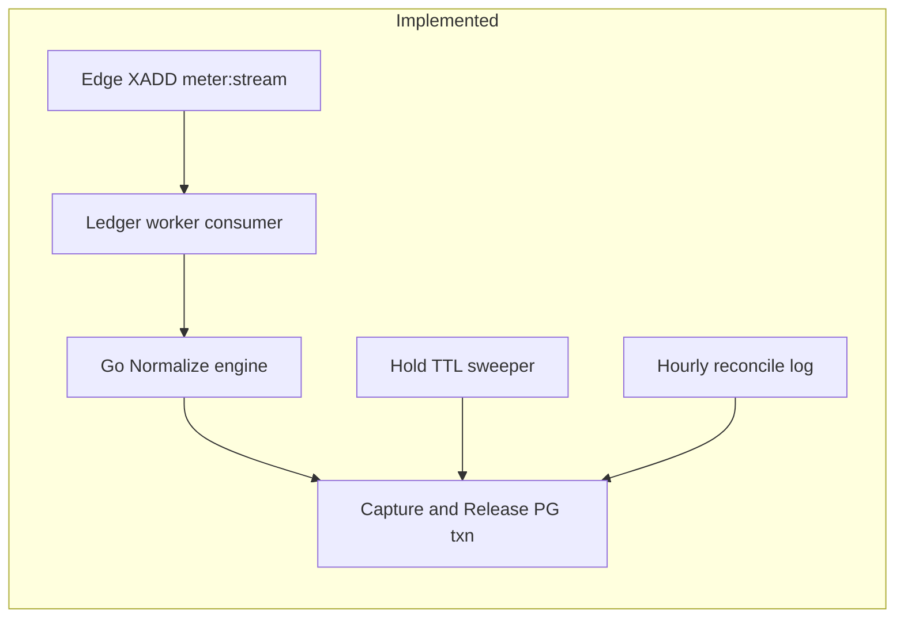
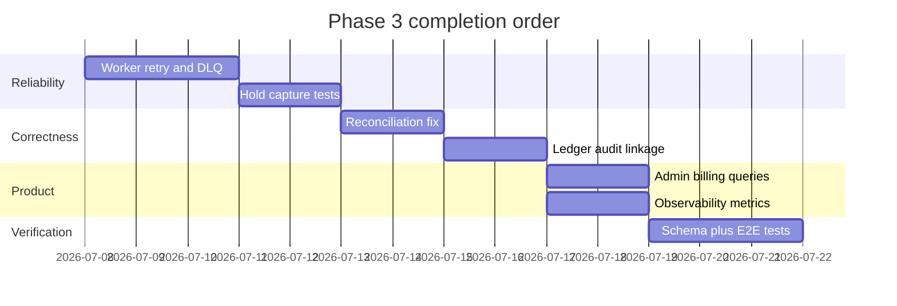

# Phase 3: Telemetry, Metering, and Credit Trickle-Down — Implementation Plan

## Prerequisites

| Phase | Status | Plan |
|-------|--------|------|
| Phase 1 — Foundation | Done | [phase_1_foundation.plan.md](phase_1_foundation.plan.md) |
| Phase 2 — Proxy & Auth | Done | [phase_2_proxy_auth.plan.md](phase_2_proxy_auth.plan.md) |

---

## Phase 3 current state

A **partial Phase 3 implementation exists** from the MVP build. Treat this plan as **completion and hardening** against [phase_1_foundation.plan.md](phase_1_foundation.plan.md) §3.

| P3 sub-task | Status | Location |
|-------------|--------|----------|
| P3.1 Redis Stream producer | Done | [`internal/gateway/route.go`](../../internal/gateway/route.go) `EmitMeterEvent`, [`internal/proxy/handler.go`](../../internal/proxy/handler.go) |
| P3.2 Ledger worker capture/release | Partial | [`cmd/ledger-worker/main.go`](../../cmd/ledger-worker/main.go) — acks on failure after DLQ push |
| P3.3 Normalization engine | Done | [`internal/metering/normalize.go`](../../internal/metering/normalize.go) |
| P3.4 OpenRouter USD passthrough | Partial | Normalize `passthrough_usd`; driver does not extract `cost_usd` from responses yet |
| P3.5 Hold TTL sweeper | Done | `runSweeper` in ledger worker |
| P3.6 Reconciliation | Partial | Logs drift; syncs Redis to **cached** PG balance, not ledger truth |
| P3.7 Admin billing queries | Not done | — |
| Observability metrics | Not done | — |
| usage_logs ↔ ledger txn IDs | Not done | — |

### Hot-path note (cross-phase)

Solvency middleware still calls [`store.ApplyHold`](../../internal/store/store.go) synchronously on every request (PG ledger `hold` row). Phase 2 plan Option B (Redis-only hold + async PG hold via worker) remains a **Phase 3 optional optimization** if latency budgets require it.

---

## Phase 3 gaps to close

### Gap 1 — Ledger worker reliability (Plan §3.1)

**Problem:** On `processEvent` error, worker pushes to `meter:dlq` then **ACKs** the message — no retry.

**Work:**

1. Add `internal/metering/worker.go` with `ProcessEvent` and retry wrapper.
2. On transient failure: do **not** ACK; rely on Redis pending entries list + `XAUTOCLAIM` or explicit retry counter in message fields.
3. After `MAX_RETRIES` (e.g. 5): `XADD meter:dlq`, then ACK.
4. Add `cmd/admin replay-dlq` or `ledger-worker --replay-dlq` for operator replay.
5. Exponential backoff between consumer poll cycles when pending count > 0.

**Files:** [`cmd/ledger-worker/main.go`](../../cmd/ledger-worker/main.go), [`internal/redis/client.go`](../../internal/redis/client.go) (pending claim helpers).

---

### Gap 2 — Hold / capture / release correctness (Plan §3.2)

**Problem:** Edge cases need explicit handling and tests.

| Scenario | Expected | Verify |
|----------|----------|--------|
| Failed before downstream | `capture=0`, `release=hold` | Proxy fail path + worker |
| Partial stream | `capture=partial`, `release=hold-partial` | integration test |
| `releaseMicro < 0` (overage) | Cap capture at hold | already in worker; add test |
| Abandoned session | Sweeper releases full hold | sweeper test |

**Work:**

1. Add `internal/metering/hold_test.go` table-driven tests for release math.
2. Ensure failed proxy emits metering event with `status=failed` and empty `raw_usage` (already true).
3. Apply `minimum_charge_micro` on **partial** completions when tokens were consumed.

---

### Gap 3 — Normalization hardening (Plan §3.3–3.4)

**Work:**

1. Pass `model` from envelope context into `raw_usage` in proxy emit when provider omits it.
2. OpenRouter: parse `usage.cost` or generation metadata if present in non-stream JSON; for SSE, map `usage` fields including nested cost when OpenRouter adds them.
3. Support `pricing_model.platform_margin` from config env override (`PLATFORM_MARGIN` already in config — wire into normalize call).
4. Driver-side `normalizeUsage` hook (optional): delegate exotic provider metrics to TS driver via IPC `action: normalize` (aligns with Phase 4; stub in Phase 3 if timeboxed).
5. Document canonical units in [`docs/architecture/credits.md`](../../docs/architecture/credits.md).

---

### Gap 4 — Reconciliation (Plan §3.1)

**Problem:** [`runReconciliation`](../../cmd/ledger-worker/main.go) compares `SUM(ledger.amount_micro)` to `users.credit_balance_micro` but on drift sets Redis to **cached** balance instead of reconciling from ledger.

**Work:**

1. Define source of truth: **ledger sum** for audit; `users.credit_balance_micro` should match ledger.
2. On drift: log at `ERROR` with user_id, cached, ledger_sum, delta.
3. Optional auto-repair flag `RECONCILE_AUTO_FIX=true`: set `users.credit_balance_micro = ledger_sum` and refresh Redis `balance:{user_id}`.
4. Emit metric `quarkgate_balance_drift_total`.
5. Admin command: `admin reconcile-user <user_id>` for manual repair.

---

### Gap 5 — Audit linkage (Plan §3.5)

**Work:**

1. Migration `003_usage_ledger_links.sql`: add `capture_txn_id`, `release_txn_id` UUID nullable columns on `usage_logs` (or JSONB `ledger_refs`).
2. Update [`CaptureAndRelease`](../../internal/store/store.go) to `RETURNING id` from ledger inserts and persist on usage_logs.
3. Admin `usage-log <request_id>` shows linked ledger rows.

---

### Gap 6 — Observability (Plan §3.5)

**Work:**

1. Add `internal/observability/metrics.go` with Prometheus handler (or `expvar` for MVP).
2. Metrics:
   - `quarkgate_requests_total{provider,status}`
   - `quarkgate_credits_captured_micro{provider}`
   - `quarkgate_hold_failures_total`
   - `quarkgate_stream_duration_seconds`
   - `quarkgate_meter_events_processed_total`
   - `quarkgate_meter_dlq_total`
3. Register `/metrics` on gateway and worker (worker on separate port or shared admin port).
4. Structured logs: include `request_id`, `user_id`, `capture_micro`, `release_micro` in worker completion log.

---

### Gap 7 — Admin billing queries (P3.7)

**Work — extend [`cmd/admin/main.go`](../../cmd/admin/main.go):**

| Command | Output |
|---------|--------|
| `balance <user_id>` | `credit_balance_micro`, ledger sum, Redis cache |
| `usage-summary <user_id>` | credits captured by `provider_slug` last 24h |
| `burn-rate <user_id>` | micro_credits/hour over 24h |
| `usage-log <request_id>` | usage_logs row + ledger txns |

SQL views optional: `v_user_usage_daily` for reporting.

---

### Gap 8 — Schema alignment (Plan §3.4)

Update [`schemas/metering-event.v1.json`](../../schemas/metering-event.v1.json):

- `hold_micro`, `partial`, `idempotency_key`, `key_id`
- Validate in CI with sample events from edge

---

### Gap 9 — Integration tests (P3 end-to-end)

**Work:** `internal/metering/integration_test.go` or `cmd/ledger-worker/integration_test.go` with testcontainers Redis + PG:

1. Create user, deposit, apply hold via store.
2. `XADD` metering event mimicking edge.
3. Run `processEvent`.
4. Assert: usage_log `completed`, balance reduced by capture only, hold released, Redis balance updated.

---

## Implementation sequence

### Granular sub-tasks

1. **P3-A** — Worker retry: no ACK on failure until retries exhausted; `XAUTOCLAIM` pending recovery.
2. **P3-B** — Hold/capture/release unit tests + partial minimum charge.
3. **P3-C** — Reconciliation: ledger as truth; `admin reconcile-user`; optional auto-fix env.
4. **P3-D** — Migration + store changes for ledger txn IDs on usage_logs.
5. **P3-E** — Normalization: model injection, OpenRouter cost fields, config margin wiring.
6. **P3-F** — Prometheus `/metrics` on gateway; worker metrics.
7. **P3-G** — Admin: `balance`, `usage-summary`, `burn-rate`, `usage-log`.
8. **P3-H** — Update `metering-event.v1.json`; CI validation.
9. **P3-I** — Redis+PG integration test for full metering loop.
10. **P3-J** — Document metering pipeline in [`docs/architecture/metering-pipeline.md`](../../docs/architecture/metering-pipeline.md).

---

## Success criteria (Phase 3 complete)

- Edge emits metering events without blocking on PG capture (hold PG write acceptable per Phase 2 Option A until async hold lands).
- Worker processes events with retry; poison messages land in DLQ with replay tooling.
- Capture + release math matches Plan §3.2 table for success, fail, and partial paths.
- Normalization handles tokens, compute seconds, DB I/O, USD passthrough for OpenRouter.
- Reconciliation detects drift and can repair user balance from ledger.
- `usage_logs` reference capture/release ledger transaction IDs.
- Admin CLI reports balance, per-provider usage, and burn rate.
- `/metrics` exposes core counters; logs correlate `request_id` across edge and worker.
- `go test ./...` includes metering integration test with real Redis + PG (testcontainers or docker-compose test profile).

---

## Files expected to change

| File | Changes |
|------|---------|
| [`cmd/ledger-worker/main.go`](../../cmd/ledger-worker/main.go) | Retry, metrics, structured logs |
| [`internal/metering/worker.go`](../../internal/metering/worker.go) | New — `ProcessEvent` logic |
| [`internal/metering/normalize.go`](../../internal/metering/normalize.go) | Model, margin, partial minimum |
| [`internal/store/store.go`](../../internal/store/store.go) | Ledger txn IDs, reconcile helpers |
| [`migrations/003_usage_ledger_links.sql`](../../migrations/003_usage_ledger_links.sql) | Audit columns |
| [`cmd/admin/main.go`](../../cmd/admin/main.go) | Billing query commands |
| [`internal/observability/metrics.go`](../../internal/observability/metrics.go) | New |
| [`schemas/metering-event.v1.json`](../../schemas/metering-event.v1.json) | Field alignment |
| [`docs/architecture/metering-pipeline.md`](../../docs/architecture/metering-pipeline.md) | New ADR |

**Do not edit** [phase_1_foundation.plan.md](phase_1_foundation.plan.md) — it remains the master reference for Phases 4–5.

---

## Relationship to Phase 4

Phase 4 adds driver-level `normalizeUsage()` via IPC. Phase 3 keeps normalization in Go reading `provider_configs.pricing_model`; Phase 4 can override per provider when driver returns supplemental `raw_usage` fields the edge cannot infer.
