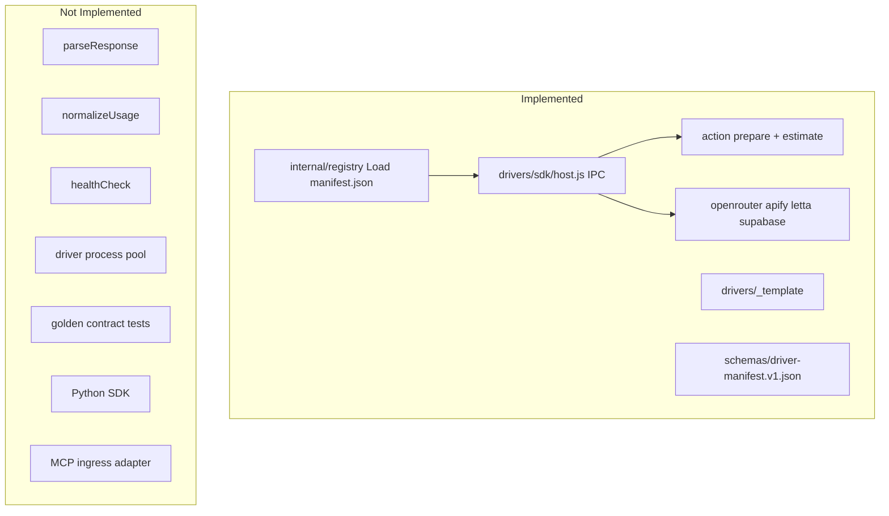
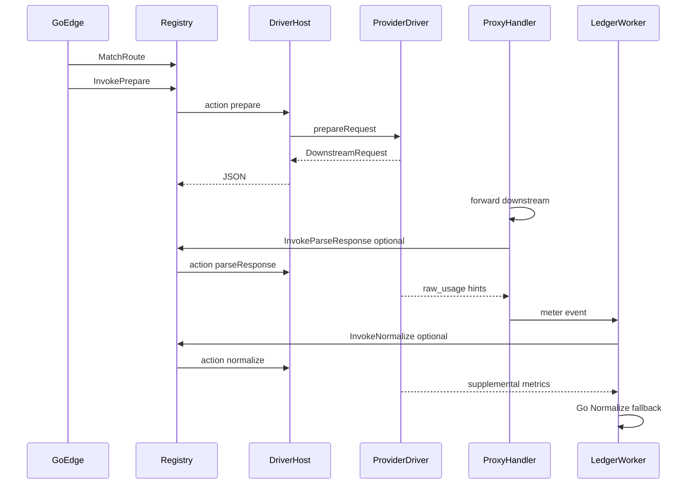
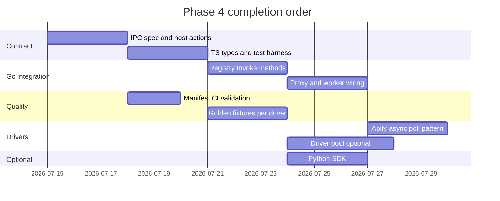

# Phase 4: Pluggable Driver Architecture — Implementation Plan

## Prerequisites

| Phase | Status | Plan |
|-------|--------|------|
| Phase 1 — Foundation | Done | [docs/plans/phase_1_foundation.plan.md](docs/plans/phase_1_foundation.plan.md) |
| Phase 2 — Proxy & Auth | Done | [docs/plans/phase_2_proxy_auth.plan.md](docs/plans/phase_2_proxy_auth.plan.md) |
| Phase 3 — Metering | Planned (pending impl) | [docs/plans/phase_3_metering.plan.md](docs/plans/phase_3_metering.plan.md) |

Phase 4 can start in parallel with Phase 3. **Coordinate on `normalizeUsage`:** Phase 3 may stub driver delegation; Phase 4 delivers the full IPC `action: normalize` path and wires ledger worker to prefer driver output when present.

---

## Phase 4 current state

A **partial driver architecture exists** from the MVP. Treat this as **completion and hardening** against [phase_1_foundation.plan.md](docs/plans/phase_1_foundation.plan.md) §4.



| P4 sub-task | Status | Location |
|-------------|--------|----------|
| P4.1 `DriverManifest` schema | Partial | [schemas/driver-manifest.v1.json](schemas/driver-manifest.v1.json) — no CI validator |
| P4.2 `drivers/sdk` package | Partial | [drivers/sdk/driver.js](drivers/sdk/driver.js), [host.js](drivers/sdk/host.js) — JS only, no types/harness |
| P4.3 IPC protocol | Partial | stdin JSON; only `prepare` + `estimate` actions |
| P4.4 Go manifest loader | Done | [internal/registry/registry.go](internal/registry/registry.go) loads `manifest.json` (not `DRIVER.md` YAML) |
| P4.5 Template + docs | Partial | [_template/](drivers/_template/) — missing full contract exports |
| P4.6 Contract test CI | Partial | [.github/workflows/ci.yml](.github/workflows/ci.yml) — single smoke, no golden fixtures |
| P4.7 Python SDK | Not done | — |

**Full interface from plan (§4.1) vs code today:**

| Method | Implemented |
|--------|-------------|
| `prepareRequest` | Yes (`driver.js`) |
| `estimateMaxCost` | Yes |
| `parseResponse` | No — proxy parses SSE/JSON in Go only |
| `normalizeUsage` | No — Go [internal/metering/normalize.go](internal/metering/normalize.go) only |
| `healthCheck` | No |

---

## Architectural target



**IPC actions (canonical):** `prepare`, `estimate`, `normalize`, `parseResponse`, `healthCheck`

---

## Phase 4 gaps to close

### Gap 1 — Formal IPC protocol spec (P4.3)

**Work:**

1. Add [docs/architecture/driver-ipc.md](docs/architecture/driver-ipc.md) documenting request/response shapes per action.
2. Extend [drivers/sdk/host.js](drivers/sdk/host.js):
   - `normalize` — input: `raw_usage`, `envelope`; output: `raw_usage` patches or `normalized` hints
   - `parseResponse` — input: `headers`, `body` (string or base64 for binary), `streaming`; output: `raw_usage`
   - `healthCheck` — output: `{ ok, latency_ms, message }`
3. Version field in IPC: `ipc_version: "1"`.
4. Structured errors: `{ "error": "...", "code": "..." }` on stderr; non-zero exit.

---

### Gap 2 — TypeScript SDK + test harness (P4.2)

**Work:**

1. Add [drivers/sdk/types.ts](drivers/sdk/types.ts) mirroring plan §4.1 (`QuarkGateDriver`, `DriverManifest`, `DownstreamRequest`).
2. Add [drivers/sdk/test-harness.js](drivers/sdk/test-harness.js) (or `npm test` in [package.json](package.json)):
   - Loads driver + manifest
   - Runs golden fixtures per action
   - Exit non-zero on mismatch
3. Optionally compile TS drivers with `tsc` → `driver.js` for contributors who prefer TS; keep runtime on Node requiring `driver.js`.
4. Update [_template/DRIVER.md](drivers/_template/DRIVER.md) with full export list.

---

### Gap 3 — Manifest validation (P4.1)

**Work:**

1. CI step: validate every `drivers/*/manifest.json` against [schemas/driver-manifest.v1.json](schemas/driver-manifest.v1.json) using `ajv` or small Go test in [internal/registry/manifest_test.go](internal/registry/manifest_test.go).
2. Fail CI if manifest `id` ≠ folder name or `provider_configs.driver_module` seed mismatch.
3. **Decision (recommended):** Keep `manifest.json` as canonical; treat `DRIVER.md` as human docs only (plan mentions YAML frontmatter — optional later, not required for MVP).

---

### Gap 4 — Go registry extensions (P4.4)

**Work in [internal/registry/registry.go](internal/registry/registry.go):**

1. `InvokeNormalize(provider, rawUsage, envelope)` → merged raw map
2. `InvokeParseResponse(provider, headers, body, streaming)` → raw_usage
3. `InvokeHealthCheck(provider, baseURL, credential)` → status for admin/readyz per-provider
4. Wire [internal/proxy/handler.go](internal/proxy/handler.go): after response, call `parseResponse` when driver exports it (feature-detect via manifest flag `capabilities.parse_response`).
5. Wire [cmd/ledger-worker/main.go](cmd/ledger-worker/main.go) or Phase 3 worker: call `InvokeNormalize` before Go `metering.Normalize`, merge driver hints into `raw`.

Add manifest capability flags:

```json
"capabilities": {
  "parse_response": true,
  "normalize_usage": true,
  "async_poll": false
}
```

---

### Gap 5 — Driver process pool (performance)

**Problem:** Each request spawns `node host.js` ([registry/exec.go](internal/registry/exec.go)) — high latency under load.

**Work:**

1. Add [internal/registry/pool.go](internal/registry/pool.go): long-lived `node drivers/sdk/host-pool.js` worker with JSON-lines protocol (one process, multiplexed requests by `id`).
2. Env `DRIVER_POOL_SIZE` (default 2); fallback to one-shot spawn when pool disabled.
3. Timeout per IPC call (5s prepare, 30s parse).

**MVP alternative:** If pool is deferred, document latency budget and keep one-shot for Phase 4 completion.

---

### Gap 6 — MVP driver hardening (§4.3 taxonomy)

| Driver | Gap | Work |
|--------|-----|------|
| **OpenRouter** | `normalizeUsage` for USD fields | Map OpenRouter-specific usage keys; `estimateStreamUsage` already partial |
| **Apify** | No async poll | Add `actor.poll` operation or `capabilities.async_poll`: prepare returns run URL; edge/worker polls until complete; meter `compute_seconds` from run stats |
| **Letta** | Single message op only | Add agent CRUD ops in manifest; `API_CALL` metering via parseResponse |
| **Supabase** | Basic REST/RPC | Add row-count hints in parseResponse from `Content-Range` / array length |

Out of MVP scope (document in plan, stub drivers only): Mem0, LangMem, Obsidian, execution pools, cmux.

---

### Gap 7 — Contract test CI (P4.6)

**Work:**

1. Add [drivers/fixtures/](drivers/fixtures/) per provider:
   - `prepare-input.json` / `prepare-output.json`
   - `normalize-input.json` / `normalize-output.json`
2. CI job `npm run test:drivers` runs harness against all non-`_template` drivers.
3. Go test [internal/registry/contract_test.go](internal/registry/contract_test.go) verifies `MatchRoute` for every `compat_paths` entry in manifests.

---

### Gap 8 — Python SDK (P4.7, optional)

**Work:**

1. [drivers/sdk/driver.py](drivers/sdk/driver.py) base helpers mirroring [driver.js](drivers/sdk/driver.js).
2. [drivers/sdk/host.py](drivers/sdk/host.py) — same IPC stdin/stdout protocol for Go to invoke via `PYTHON_PATH`.
3. Go registry: `python drivers/sdk/host.py` when driver folder contains `driver.py` instead of `driver.js`.
4. One reference driver not required for Phase 4 completion — SDK + docs sufficient.

---

### Gap 9 — Protocol translation layers (§4.4)

**In scope for Phase 4:**

1. **Ingress adapters** — formalize in [internal/gateway/route.go](internal/gateway/route.go):
   - OpenAI-compat (`/v1/chat/completions`)
   - QuarkGate envelope (`/v1/quarkgate`)
   - Provider paths (`/v1/providers/{id}{path}`)
2. **Response adapter** — optional OpenAI-shaped wrapping via driver `adaptResponse` (stretch) or document as Phase 5.

**Post-MVP (document only):** MCP JSON-RPC ingress mapping `tools.{name}` → operations; driver manifest `tools` registry section.

---

## Implementation sequence



### Granular sub-tasks

1. **P4-A** — `driver-ipc.md` + extend `host.js` with `normalize`, `parseResponse`, `healthCheck`
2. **P4-B** — `drivers/sdk/types.ts`, test harness, `npm run test:drivers`
3. **P4-C** — Manifest JSON Schema validation in CI + Go manifest tests
4. **P4-D** — `InvokeNormalize`, `InvokeParseResponse`, `InvokeHealthCheck` in registry
5. **P4-E** — Proxy: optional `parseResponse` after downstream; merge into `raw_usage`
6. **P4-F** — Ledger worker: driver `normalize` before Go normalize (Phase 3 integration point)
7. **P4-G** — Golden fixtures for openrouter, apify, letta, supabase
8. **P4-H** — Apify async poll driver + metering `compute_seconds`
9. **P4-I** — Update `_template`, contributor guide [docs/architecture/drivers.md](docs/architecture/drivers.md)
10. **P4-J** — (Optional) process pool or document deferral
11. **P4-K** — (Optional) Python host + SDK

---

## Success criteria (Phase 4 complete)

- Contributor can add a provider by copying `_template/`, filling `manifest.json` + `driver.js`, and passing `npm run test:drivers`
- All four MVP drivers pass golden contract tests in CI
- IPC supports full five-action contract (prepare, estimate, normalize, parseResponse, healthCheck)
- Go edge invokes drivers without embedding provider-specific transform logic outside registry
- Apify actor runs can complete via poll pattern with `COMPUTE_S` metering
- Ledger worker can use driver-supplied `normalizeUsage` when present, with Go fallback
- `admin driver-health <provider>` (or readyz sub-check) reports per-provider health via `healthCheck`
- Manifest validation fails CI on invalid contributor PRs

---

## Files expected to change

| File | Changes |
|------|---------|
| [drivers/sdk/host.js](drivers/sdk/host.js) | Full IPC actions |
| [drivers/sdk/types.ts](drivers/sdk/types.ts) | New — interface types |
| [drivers/sdk/test-harness.js](drivers/sdk/test-harness.js) | New — fixture runner |
| [internal/registry/registry.go](internal/registry/registry.go) | Invoke* methods, capabilities |
| [internal/proxy/handler.go](internal/proxy/handler.go) | parseResponse hook |
| [cmd/ledger-worker/main.go](cmd/ledger-worker/main.go) | normalize delegation |
| [drivers/fixtures/](drivers/fixtures/) | Golden files per provider |
| [.github/workflows/ci.yml](.github/workflows/ci.yml) | `test:drivers`, schema validate |
| [docs/architecture/driver-ipc.md](docs/architecture/driver-ipc.md) | New |
| [docs/architecture/drivers.md](docs/architecture/drivers.md) | Contributor guide |
| [docs/plans/phase_4_drivers.plan.md](docs/plans/phase_4_drivers.plan.md) | This plan (copy from CreatePlan output) |

**Do not edit** [phase_1_foundation.plan.md](docs/plans/phase_1_foundation.plan.md).

---

## Relationship to Phase 5

Phase 5 (MVP milestones M3–M9 hardening) depends on Phase 4 drivers being contract-stable for E2E orchestrator and chaos tests. MCP ingress and execution-pool drivers remain Phase 5+ / post-MVP per [phase_1_foundation.plan.md](docs/plans/phase_1_foundation.plan.md) §5.1.
