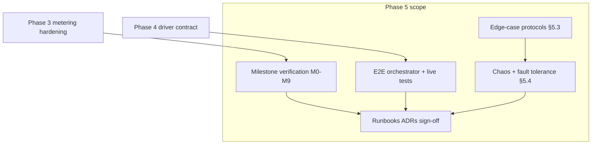
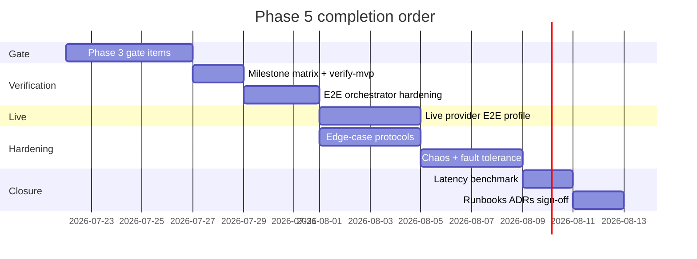

# Phase 5: MVP Milestones & Fault-Tolerance Hardening — Implementation Plan

## Prerequisites

| Phase | Status | Plan | Phase 5 dependency |
|-------|--------|------|-------------------|
| Phase 1 — Foundation | Done | [phase_1_foundation.plan.md](phase_1_foundation.plan.md) | Schema, vault, admin CLI |
| Phase 2 — Proxy & Auth | Done | [phase_2_proxy_auth.plan.md](phase_2_proxy_auth.plan.md) | Middleware, SSE, idempotency |
| Phase 3 — Metering | **Not complete** | [phase_3_metering.plan.md](phase_3_metering.plan.md) | **Blocks M4, M9 reconciliation** |
| Phase 4 — Drivers | Done | [phase_4_drivers.plan.md](phase_4_drivers.plan.md) | Driver contract, golden tests, Apify poll |

Phase 5 is **not** a new feature phase — it is **verification, hardening, and operational closure** of the MVP defined in Phase 1 §5.1–5.4.

---

## MVP scope (from Phase 1 §5.1)

**In scope:** OpenRouter (LLM), Apify (scraping), Letta + Supabase (memory)

**Out of scope (document only):** Direct OpenAI/Anthropic/Google, Mem0, LangMem, Obsidian, execution pools, cmux, MCP ingress

---

## Milestone verification matrix (M0–M9)

Current repo assessment against Phase 1 §5.2 verification criteria:

| Milestone | Deliverable | Verification | Status | Evidence / gap |
|-----------|-------------|--------------|--------|----------------|
| **M0** | PG schema, Redis, docker-compose, vault | `make test-infra` connects | **Done** | [`Makefile`](../../Makefile), [`docker-compose.yml`](../../docker-compose.yml) — Redis not explicitly checked in `test-infra` |
| **M1** | User + key creation CLI, auth middleware | Invalid key → 401 | **Done** | [`cmd/admin`](../../cmd/admin), [`AuthMiddleware`](../../internal/gateway/middleware.go) |
| **M2** | Hold on request, 402 on zero balance | Balance 0 → 402 before downstream | **Done** | [`SolvencyMiddleware`](../../internal/gateway/middleware.go) |
| **M3** | OpenRouter chat, SSE streaming, token metering | `curl` streaming; usage_log populated | **Partial** | Proxy + driver exist; **no live E2E proof**; stream fallback tokenizer incomplete |
| **M4** | Async capture/release; balance decrements | Ledger sum matches balance | **Partial** | Worker exists; **Phase 3 gaps** (reconciliation, retry, audit linkage) |
| **M5** | Apify run + poll; meter compute seconds | Actor completes; credits deducted | **Partial** | [`drivers/apify`](../../drivers/apify), proxy poll; **no live E2E**; poll blocks in proxy path |
| **M6** | Letta agent API proxy; meter API calls | Create agent + message via QuarkGate | **Partial** | Driver + compat path; **single op only**; no live E2E |
| **M7** | Supabase vector proxy; meter reads/writes | pgvector search via QuarkGate | **Partial** | `rpc.match_documents` + REST; **no live E2E** |
| **M8** | E2E orchestrator one key across four providers | Single script, one bearer token | **Partial** | [`examples/swarm-minimal/orchestrator.js`](../../examples/swarm-minimal/orchestrator.js) — logs status only, no assertions |
| **M9** | Circuit breakers, mid-stream failure, reconciliation | Chaos tests pass | **Partial** | [`breaker.go`](../../internal/proxy/breaker.go), [`chaos_test.go`](../../internal/proxy/chaos_test.go) — placeholders; reconciliation drift unfixed |

**Phase 5 primary goal:** move every **Partial** row to **Verified** with automated or scripted proof.

---

## Phase 5 gaps to close

### Gap 1 — Phase 3 gate (blocks M4 + M9)

Phase 5 cannot sign off ledger accuracy until Phase 3 completion items land:

| P3 item | Why it blocks Phase 5 |
|---------|----------------------|
| Worker retry / no ACK on transient failure | Chaos Redis flush tests need reliable replay |
| Reconciliation: ledger as source of truth | M4 verification, 1000-request accuracy test |
| `usage_logs` ↔ ledger txn IDs | M4 audit trail, `admin usage-log` |
| Admin billing queries | E2E orchestrator balance assertions |
| `/metrics` + worker counters | M9 observability, latency budget monitoring |
| Metering integration test | CI proof of hold → capture → release loop |

**Recommendation:** Treat [phase_3_metering.plan.md](phase_3_metering.plan.md) P3-A through P3-I as **Phase 5 prerequisite workstream** (implement before M4/M9 sign-off).

---

### Gap 2 — E2E orchestrator (M8)

**Current:** [`examples/swarm-minimal/orchestrator.js`](../../examples/swarm-minimal/orchestrator.js) fires four requests and prints HTTP status.

**Work:**

1. Add `examples/swarm-minimal/config.js` — provider-specific payload from env (`APIFY_ACTOR_ID`, `LETTA_AGENT_ID`, `SUPABASE_URL` hints).
2. After each step: assert `status` in expected set; for OpenRouter parse JSON and assert non-empty content.
3. Post-run: call `admin balance` or query PG for `usage_logs` count ≥ 1 and `credits_captured_micro > 0`.
4. Add `make e2e-smoke` — starts infra, seeds user/key/credits, runs orchestrator against **mock downstream** (httptest profile) for CI.
5. Add `make e2e-live` — requires `.env.e2e` with vault credentials (not in CI by default).

---

### Gap 3 — Live provider E2E (M3, M5–M7)

**Work:**

1. `docker-compose.e2e.yml` or test profile: gateway + worker + PG + Redis only (no mock providers).
2. Seed `qg_test_*` key with test credits; store credentials via `admin store-credential`.
3. `tests/e2e/live_openrouter_test.go` (build tag `e2e`): streaming chat, assert usage_log within 30s.
4. `tests/e2e/live_apify_test.go`: short actor run, assert `compute_seconds` in raw_usage.
5. Document required secrets in `examples/swarm-minimal/README.md`.

**Blocker:** Requires operator decision on **which sandbox accounts** and **spend caps** for CI vs manual-only live tests.

---

### Gap 4 — Edge-case protocols (§5.3)

| Protocol | Plan requirement | Current state | Work |
|----------|------------------|---------------|------|
| Mid-stream downstream failure | `status=partial`, pro-rated capture, release remainder | Partial metering on chaos test | Assert metering event fields in chaos test; apply `minimum_charge_micro` on partial |
| Terminal SSE error (OpenAI-compat) | `data: {"error":...}` on truncate | Not implemented | Inject error event in proxy on partial/fail for compat routes |
| Zero balance mid-agent | Each tool call separate hold | Design OK | Integration test: sequential 402 after balance exhausted |
| Stream soft-cap (under-estimate) | Inject `insufficient_credits`, capture full hold | **Not implemented** | Running cost vs hold in `meteringReader`; close downstream when exceeded |
| Downstream connect timeout | 5s → 502, release hold | Connect timeout configured | Verify fail path releases hold in integration test |
| Vault failure | 503 generic, release hold | Route middleware returns 503 | Test + ensure hold released on prepare failure |
| Redis down | Fail closed 503 | Not explicitly tested | Integration test with Redis stopped |
| PG down | Auth from cache; meter queues | Partial — no PG-down test | Document + test auth cache-only path |
| Retry-After on partial | Header on retriable failures | Rate limit only | Add on 502/503 partial responses |

---

### Gap 5 — Fault tolerance (§5.4)

| Component | Status | Work |
|-----------|--------|------|
| Circuit breaker per provider | **Done** — [`internal/proxy/breaker.go`](../../internal/proxy/breaker.go) | Add test: open circuit returns 503 before downstream |
| Bulkhead (max concurrent per provider) | **Not done** | `internal/proxy/bulkhead.go`; env `BULKHEAD_PER_PROVIDER` |
| DLQ | Partial — push on failure | Phase 3 replay tooling; runbook |
| Graceful shutdown | Partial — gateway `Shutdown` | Drain active streams; worker stop after pending processed |
| Per-provider readyz | Partial — `driver-health` CLI | Optional `/readyz/providers` or extend readyz |

---

### Gap 6 — Chaos test hardening (M9)

**Current:** [`internal/proxy/chaos_test.go`](../../internal/proxy/chaos_test.go) — mid-stream hijack (weak assertion), zero-balance placeholder.

**Work:**

1. Mid-stream: assert `partial` metering would emit (mock Redis capture or test hook).
2. `TestChaosRedisUnavailable` — gateway returns 503 on solvency when Redis down.
3. `TestChaosReconciliationAfter1000Events` — load test script + reconciliation delta < 0.01%.
4. `TestChaosDLQReplay` — poison event → DLQ → replay → success.
5. Move integration-level chaos to `internal/gateway/chaos_test.go` with testcontainers.

---

### Gap 7 — Streaming latency budget (MVP success criteria)

Phase 1: *"Streaming LLM responses pass through without buffering delay >50ms vs direct"*

**Work:**

1. Benchmark harness: mock SSE server vs QuarkGate proxy vs direct client.
2. Record p50/p95 chunk latency delta; fail CI if p95 > 50ms on localhost (generous for CI).
3. Document driver IPC overhead separately (one-shot spawn ~20–50ms per request).

---

### Gap 8 — Operational artifacts

| Artifact | Status | Work |
|----------|--------|------|
| ADR-001–005 | Not written | `docs/adr/` |
| Edge-case runbook | Not written | `.cursor/memory/runbooks/mvp-edge-cases.md` |
| Metering pipeline doc | Not written | `docs/architecture/metering-pipeline.md` (Phase 3) |
| `make verify-mvp` | Not written | Runs test-infra + unit + driver contract + e2e-smoke |

---

### Gap 9 — Post-MVP documentation (no implementation)

Document in `docs/architecture/post-mvp.md`:

- MCP JSON-RPC ingress (`tools.{name}` → operations)
- Driver process pool (`DRIVER_POOL_SIZE`)
- Mem0, LangMem, Obsidian, execution pool drivers
- Kafka/Redpanda when Redis Streams insufficient
- WASM sandbox for drivers vs subprocess IPC
- User dashboard / `top_up_url` for 402 responses

---

## Implementation sequence

### Granular sub-tasks

1. **P5-A** — Milestone audit doc + `make verify-mvp` + extend `test-infra` (Redis ping).
2. **P5-B** — Complete Phase 3 P3-A–I (prerequisite gate).
3. **P5-C** — Harden `examples/swarm-minimal/` + `make e2e-smoke` (mock downstream).
4. **P5-D** — Live E2E profile + `examples/swarm-minimal/README.md` secrets guide.
5. **P5-E** — Edge-case protocols: soft-cap, terminal SSE error, partial minimum charge.
6. **P5-F** — Bulkhead, graceful shutdown drain, expanded chaos tests.
7. **P5-G** — Streaming latency benchmark + driver IPC overhead note.
8. **P5-H** — ADRs, runbooks, `post-mvp.md`, MVP sign-off checklist.
9. **P5-I** — Optional: `/readyz` per-provider via `InvokeHealthCheck`.

---

## Success criteria (Phase 5 / MVP complete)

From Phase 1 §Success Criteria for MVP:

- [ ] One `qg_live_*` or `qg_test_*` key accesses OpenRouter, Apify, Letta, Supabase — **proven by e2e-smoke + optional e2e-live**
- [ ] Streaming passthrough p95 latency delta ≤ 50ms vs direct on localhost benchmark
- [ ] Credit balance accurate to within 0.01% after 1000 mixed requests (reconciliation test)
- [ ] New driver = new `drivers/<name>/` folder + seed row only (contributor path verified by CI)
- [ ] Mid-stream failure and zero-balance behave per §5.3 protocols (automated tests)
- [ ] Circuit breaker, DLQ replay, and graceful shutdown documented and tested
- [ ] All milestones M0–M9 marked **Verified** in milestone matrix

---

## Files expected to change

| File | Changes |
|------|---------|
| [`examples/swarm-minimal/`](../../examples/swarm-minimal/) | Assertions, README, config |
| [`Makefile`](../../Makefile) | `verify-mvp`, `e2e-smoke`, `e2e-live` |
| [`internal/proxy/handler.go`](../../internal/proxy/handler.go) | Soft-cap, terminal SSE error |
| [`internal/proxy/stream_meter.go`](../../internal/proxy/stream_meter.go) | Running cost vs hold |
| [`internal/proxy/bulkhead.go`](../../internal/proxy/bulkhead.go) | New |
| [`internal/proxy/chaos_test.go`](../../internal/proxy/chaos_test.go) | Strong assertions |
| [`cmd/gateway/main.go`](../../cmd/gateway/main.go) | Graceful drain, bulkhead wire |
| [`tests/e2e/`](../../tests/e2e/) | Live + smoke E2E |
| [`docs/adr/`](../../docs/adr/) | ADR-001–005 |
| [`docs/architecture/post-mvp.md`](../../docs/architecture/post-mvp.md) | New |
| Phase 3 files | See [phase_3_metering.plan.md](phase_3_metering.plan.md) |

**Do not edit** [phase_1_foundation.plan.md](phase_1_foundation.plan.md).

---

## Outstanding decisions & blockers

These items require **explicit product/engineering decisions** before or during Phase 5. They are the primary blockers to progress.

### Blocking (must decide before M4/M9 sign-off)

| # | Decision | Options | Recommendation | Impact if unresolved |
|---|----------|---------|----------------|----------------------|
| **D1** | **Phase 3 before Phase 5 sign-off?** | (A) Strict gate — finish P3 first; (B) Parallel — verify M3/M5–M8 while P3 in flight | **A** — ledger truth required for MVP criteria | Reconciliation test cannot pass; M4 stays Partial |
| **D2** | **Solvency hot-path** | (A) Keep sync PG hold (Option A); (B) Redis-only hold + async PG hold (Option B) | **A** for MVP; document latency; defer B | Affects load testing targets and worker contract |
| **D3** | **Reconciliation auto-repair** | `RECONCILE_AUTO_FIX=true` vs manual `admin reconcile-user` only | Auto-fix in dev/staging; manual in prod | Drift may persist silently in prod |
| **D4** | **Live E2E in CI?** | (A) CI mock-only; (B) CI with sandbox keys + spend cap; (C) manual `e2e-live` only | **A + C** — no provider spend in default CI | M3/M5–M7 stay manual-verified only |

### Important (affect scope/timeline)

| # | Decision | Options | Recommendation |
|---|----------|---------|----------------|
| **D5** | **Apify poll location** | (A) Proxy blocks until poll complete (current); (B) Return RUNNING to client, poll in worker only | **A** for simple metering; **B** for responsive API | Current proxy poll increases latency and ties gateway to long polls |
| **D6** | **Stream soft-cap** | Implement full soft-cap vs capture full hold on under-estimate only at worker | Implement soft-cap per §5.3 | Without it, under-estimated holds may allow overage |
| **D7** | **402 `top_up_url`** | Placeholder URL vs omit until dashboard exists | Placeholder `https://quarkgate.dev/dashboard/credits` | Cosmetic for MVP |
| **D8** | **Observability stack** | Prometheus only vs OpenTelemetry traces | Prometheus for MVP; OTel stub | Affects P5 observability scope |
| **D9** | **Letta surface area** | Single `agents.messages.create` vs full agent CRUD in MVP | Single op for MVP; document CRUD as post-MVP | M6 verification scope |
| **D10** | **Driver IPC pool** | Implement pool in Phase 5 vs keep deferred | Keep deferred; benchmark overhead in P5-G | Load test may show IPC bottleneck |

### Non-blocking polish (can defer past MVP)

- PostgreSQL RLS policies (Phase 1 optional)
- golang-migrate versioning table vs raw `Exec` migrations
- JSON Schema CI for `quarkgate-request.v1.json`
- MCP ingress adapter
- User-facing dashboard

---

## Relationship to other phases

- **Phase 3** supplies ledger reliability, metrics, and admin queries — **hard dependency** for M4/M9.
- **Phase 4** supplies stable drivers and golden tests — **done**; enables E2E and live tests.
- **Post-MVP** items from Phase 1 §4.3 and §4.4 remain documented, not implemented.
